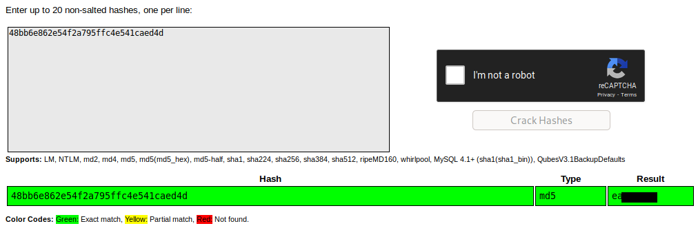
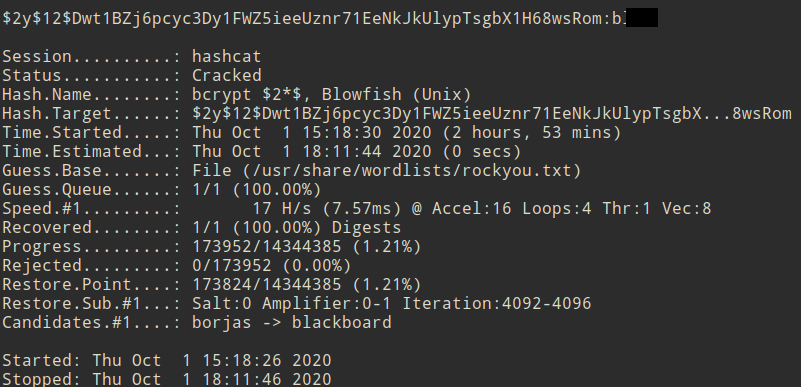

# Crack the hash Writeup


This room is a good one for those who want to learn hash cracking, i was one of them  :relieved:.

:warning: **But** before getting involve we should know how to identify hashes, in this issue we have many options.

### hash identifiers
* **CLI on Linux "Terminal"**

  - **hash-identifier**
  ```
  root@therubick:~# hash-identifier 
   #########################################################################
   #     __  __                     __           ______    _____           #
   #    /\ \/\ \                   /\ \         /\__  _\  /\  _ `\         #
   #    \ \ \_\ \     __      ____ \ \ \___     \/_/\ \/  \ \ \/\ \        #
   #     \ \  _  \  /'__`\   / ,__\ \ \  _ `\      \ \ \   \ \ \ \ \       #
   #      \ \ \ \ \/\ \_\ \_/\__, `\ \ \ \ \ \      \_\ \__ \ \ \_\ \      #
   #       \ \_\ \_\ \___ \_\/\____/  \ \_\ \_\     /\_____\ \ \____/      #
   #        \/_/\/_/\/__/\/_/\/___/    \/_/\/_/     \/_____/  \/___/  v1.2 #
   #                                                             By Zion3R #
   #                                                    www.Blackploit.com #
   #                                                   Root@Blackploit.com #
   #########################################################################
  --------------------------------------------------
  HASH: 

  ```
   - **hashid**
   ```
  root@root:~# hashid -h
  usage: hashid.py [-h] [-e] [-m] [-j] [-o FILE] [--version] INPUT

  Identify the different types of hashes used to encrypt data

  positional arguments:
    INPUT                    input to analyze (default: STDIN)

  options:
    -e, --extended           list all possible hash algorithms including salted passwords
    -m, --mode               show corresponding Hashcat mode in output
    -j, --john               show corresponding JohnTheRipper format in output
    -o FILE, --outfile FILE  write output to file
    -h, --help               show this help message and exit
    --version                show program's version number and exit

  License GPLv3+: GNU GPL version 3 or later <http://gnu.org/licenses/gpl.html>
  ```


* **Online**

  * [**hashes**](https://hashes.com/en/tools/hash_identifier)
  * [**onlinehashcrack**](https://www.onlinehashcrack.com/hash-identification.php)
  * [**md5hashing**](https://md5hashing.net/hash_type_checker)

### Note
* some of these tools **may not** identify a certain hash type while others could.
* in some cases not all the tools would identify the hash by the **same type**. So, we should test **all** the types that we have obtained.

So let's go.  :punch:

## Level 1
In this level we will try to crack hashes online on [**Crack Station**](https://crackstation.net/), if it failed we would go cracking them with **hashcat** or **john the ripper**.

### Question 1
This question was so easy. Simply, by Submitting the hash into **Crack station** we could crack it.


### Question 2
The Same method as we did in Question 1.

### Question 3
The Same method as we did in Question 1.

### Question 4
* If you tried to crack the hash using **Crack Station** it willn't work :disappointed:. So we must crack it by **hashcat** or **john the ripper**, make sure you have any of them installed in your machine. But we will first identify this hash using the tools mentioned above.
* After identifying the hash using hashid we could some cool results 

```
root@root:~# hashid
$2y$12$Dwt1BZj6pcyc3Dy1FWZ5ieeUznr71EeNkJkUlypTsgbX1H68wsRom
Analyzing '$2y$12$Dwt1BZj6pcyc3Dy1FWZ5ieeUznr71EeNkJkUlypTsgbX1H68wsRom'
[+] Blowfish(OpenBSD) 
[+] Woltlab Burning Board 4.x 
[+] bcrypt
```
 These are the same results obtained from **hashes** and **onlinehashcrack**
* Also if you notice the **$2y$** segment in the hash, this indicates that the hash type which is **bcrypt**.
* Crack the hash using **hashcat**,* you can use **john the ripper** but we would use hashcat*. 
* Some notes about **hashcat** important parameters :
  * -a identifies the type of attack. In this writeup we would use type 0 "simple one"
  * -m identifies the hash type that we want to crack *"which is 3200 in our case"*. We could check the type of the hash from this [**webpage**](https://hashcat.net/wiki/doku.php?id=example_hashes)
  * the third parameter are the hash we want to crack or the files includes it. It is preferable to store hashes in a text file before cracking it as i did and saved it in **file.txt**.
  * the last parameter is the wordlist file that we will use in cracking, and in our case it will be **rockyou.txt** which is mentioned in the room.
  * for another parameters you can hit ```hashcat -h``` in the terminal
* So in this question we will hit ```hashcat -a 0 -m 3200 file.txt /usr/share/wordlists/rockyou.txt```
* After waiting for **nearly 3 hours**  :sleeping:, we cracked the hash :muscle: 

### Question 5
The Same method as we did in Question 1.

## Level 2
Here in this level we *must* use **rockyou.txt** to crack the hashes.
### Question 1
After analysing the hash type from the tools mentioned above, it seems to be **SHA-256**.
All what we will do is hitting ```hashcat -a 0 -m 1400 file.txt /usr/share/wordlists/rockyou.txt``` in the terminal, then we would got the hash cracked.
### Question 2
In this question we would deduce that all the tools have identified MD2,MD5 as possible hashes except **hashes** as it identified the hash as **NTLM** which is the true hash type :smile:, and that is why we have said you **should** try all the hash identifier tools and don't depend on only one.
All what we will do now is hitting ```hashcat -a 0 -m 1000 file.txt /usr/share/wordlists/rockyou.txt``` in the terminal, then we would got the hash cracked.
### Question 3
This one took me alot of time not because i didn't recognize the hash type but the number of round **#rounds = 5** was deceiving :angry:. Thanks to **NinjaJc01|James** who advised me to ignore the number of rounds :clap:.

Anyway back to our problem, as we notice the **$6$** which indicates the type of the hash : **sha512crypt**
All what we will do now is hitting ```hashcat -a 0 -m 1800 file.txt /usr/share/wordlists/rockyou.txt``` in the terminal, then we would got the hash cracked after half an hour *most probably as it may take more/less depending on your machine*.
### Question 4
This one also took me time because of the hash type in this time  :sweat:.
After trying to crack the hash using the types mentioned as the *possible hashes* from all the above tools, none of them worked :disappointed_relieved:.
Then we looked at the least possible hashes starting from **hash-identifier**, i got that hash type :muscle: and it was **HMAC-SHA1**

**Note**
in our case we need to add the salt in this format : e5d8870e5bdd26602cab8dbe07a942c8669e56d6:tryhackme in the text file.
All what we will do now is hitting ```hashcat -a 0 -m 150 file.txt /usr/share/wordlists/rockyou.txt``` in the terminal, then we would got the hash cracked

I hope you enjoyed my writeup as i enjoyed writing it :smile:
If there is any issues,mis-understandings plz write them in the comments by making pull requests.

